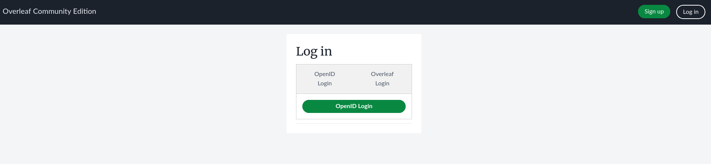
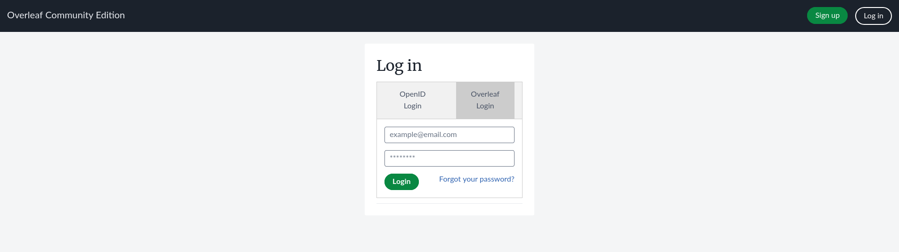

<h1 align="center">
  <br>
  <a href="https://www.overleaf.com"></a>
</h1>

<h4 align="center">An open-source online real-time collaborative LaTeX editor.</h4>

<p align="center">
  <a href="https://github.com/overleaf/overleaf/wiki">Wiki</a> •
  <a href="https://www.overleaf.com/for/enterprises">Server Pro</a> •
  <a href="#contributing">Contributing</a> •
  <a href="https://mailchi.mp/overleaf.com/community-edition-and-server-pro">Mailing List</a> •
  <a href="#authors">Authors</a> •
  <a href="#license">License</a>
</p>


<p align="center">
  Figure 1: A screenshot of a project being edited in Overleaf Community Edition.
</p>

> [!important]
> This is a development version. If you simply want to run your own Overleaf instance with OpenID Connect support check out [my fork of overleaf-toolkit](https://github.com/mvrp21/toolkit).
>
> I also changed the default port for the frontend from :80 to :8000. Don't go around using sudo for nothing folks.

## OpenID Connect

This was a very quick fork because we needed OpenID Connect support. If you think some feature's missing feel free to contribute!

### How it works

> [!note]
> This fork keeps both login methods available.

There is an extra route to 

When you enable OpenID login via `OPENID_ENABLED=true`, the login page will look like the following image:



You can also access the "normal" login:



When a user logs in via OpenID Connect, two things may happen:
1. If the user does not exist in the Overleaf DB it is created with a random password.
2. If the user exists, the login continues as it normally would.

> [!question]
> > Does that mean that if I reset my password after creating a user with the OpenID login I can log in with both methods?
>
> Yes.

### Using OpenID Connect

This fork adds support for OpenID Connect based login. All you need to do is add the foolowing to your `dev.env`:

```
OPENID_ENABLED=true
OPENID_ISSUER=your-issuer
OPENID_AUTHORIZATION_URL=your-auth-url
OPENID_TOKEN_URL=your-token-url
OPENID_USERINFO_URL=your-userinfo-url
OPENID_CLIENT_ID=your-client-id
OPENID_CLIENT_SECRET=your-client-secret
```

You can also change the default text for the login methods setting the following:

```
OPENID_LOGIN_TEXT=OIDC Login
OVERlEAF_LOGIN_TEXT=Default Login
```

Test this out by going into `develop` and running `./bin/dev --build`!

## Installation

I've also forkerd [Overleaf Toolkit](https://github.com/mvrp21/toolkit/), take a look at that.

## Authors

[The Overleaf Team](https://www.overleaf.com/about)

[Me :)](https://github.com/mvrp21)

## License

The code in this repository is released under the GNU AFFERO GENERAL PUBLIC LICENSE, version 3. A copy can be found in the [`LICENSE`](LICENSE) file.

Copyright (c) Overleaf, 2014-2025.
